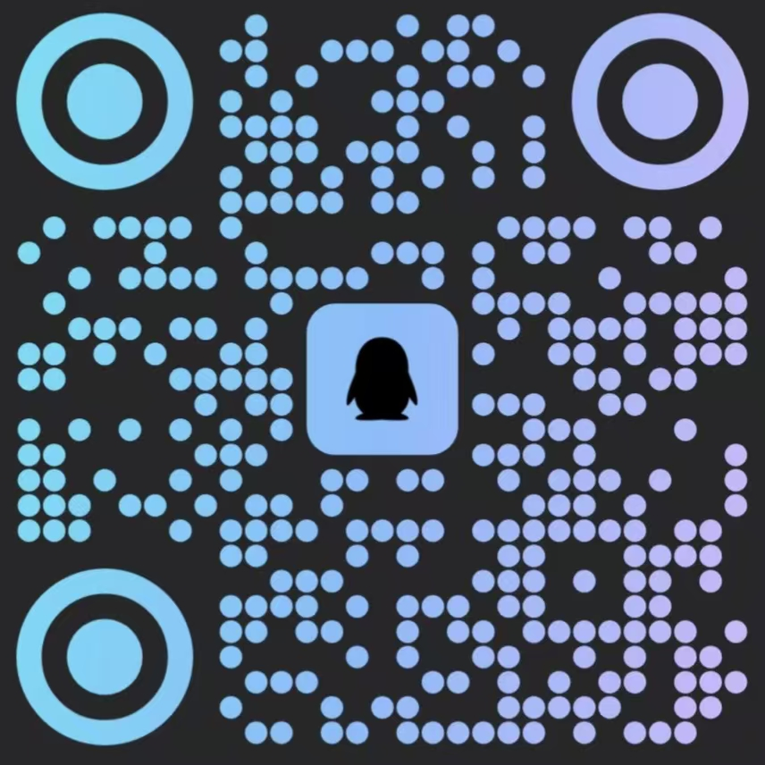

<p align="center">
  
  
  
  
  
  
  
</p>

<p align="center">
  
</p>

<h1 align="center">ChillPass</h1>

<p align="center">
  <strong>你的 AI 学习伙伴 —— 从期末冲刺到论文写作</strong>
</p>

<p align="center">
  <a href="#-核心功能">核心功能</a> &bull;
  <a href="#-安装">安装</a> &bull;
  <a href="#-加入交流群">加入交流群</a> &bull;
  <a href="#-快速上手">快速上手</a> &bull;
  <a href="#-技术栈">技术栈</a> &bull;
  <a href="https://github.com/Koipoppy/ChillPass-Web/releases">下载</a>
</p>

<p align="center">
  <a href="https://github.com/Koipoppy/ChillPass-Web/releases/latest">
    
  </a>
</p>

---

## 什么是 ChillPass？

ChillPass 是一款**桌面应用**，把你的课程资料（PDF、PPTX、TXT、MD）转化为**闯关式学习体验**。上传课件后，AI 引擎会自动提取考试重点，生成带例题的结构化课程，并创建自适应小测——所有内容按考到的概率高低排序。

从 **v1.2.3** 起，ChillPass 重构为**浏览器式 Web 应用**，通过 Node.js SEA（Single Executable Application）打包成独立的 Windows 可执行文件。无需 Electron、无需重型运行时——只有一个 `chillpass.exe`，启动本地 HTTP 服务并打开默认浏览器。数据 100% 本地保存（IndexedDB + localStorage），完全离线运行。

**工作流程：**

```
上传资料 → AI 提取考点 → 生成闯关路径 → 逐关闯关
                        ↓
        必考 / 高频 / 了解（三个优先级）
                        ↓
      知识点讲解 → 例题 → 小测 → 赚取 Chill 币
                        ↓
                   Athena 智能体
        ┌──────────────┼──────────────┐
    论文写作        报告写作        知识总结
        └──────────────┼──────────────┘
                 复习规划
```

---

## 核心功能

### 闯关式学习引擎

| 功能 | 说明 |
|---------|-------------|
| **AI 考点提取** | DeepSeek 分析你的资料，提取考试考点，按三个优先级分类 |
| **批量处理** | 200+ 页 PDF 分块提取、并行处理、去重合并——一页都不会漏 |
| **渐进解锁** | 完成一关解锁下一关。每关包含知识点、例题和通关小测 |
| **自适应小测** | 每题一页，带进度导航。答错后同考点重新出题，直到掌握 |
| **重新生成与跳过** | 卡住了？免费重新生成同考点新题，或花 10 Chill 币跳过 |
| **动态难度** | 题量随考点优先级缩放——必考 4-5 题，了解级 2 题 |
| **课程管理** | 课程可一键导出（含全部已生成关卡）为 JSON 分享给他人，也可导入好友的课程、卸载不再需要的课程 |
| **重复课程检测** | 导入同名课程时弹出替换确认，不再产生重复课程 |

### 六种题型 + AI 批改

```
┌─────────────┬──────────────────────────────────────────────┐
│    题型      │                  行为                        │
├─────────────┼──────────────────────────────────────────────┤
│  单选题      │ 4 个选项，即时对错反馈                        │
│  多选题      │ 4-6 个选项，至少 2 个正确，提交后判分           │
│  填空题      │ 自由文本输入，关键词匹配 + AI 批改             │
│  简答题      │ 自由作答，AI 评分，附参考答案                  │
│  计算题      │ 分步解答，AI 逐步评分                          │
│  论述题      │ 长篇作答，AI 按结构评分                        │
└─────────────┴──────────────────────────────────────────────┘
```

答错触发**自适应重试**：
- **选择题** → 选项乱序，再试一次
- **填空 / 简答** → AI 在相同考点重新生成全新题目

### 本地账户系统

完全离线的账户体系——没有服务器、没有登录、没有追踪：

| 能力 | 说明 |
|-----------|-------------|
| **自动创建** | 首次启动自动创建默认本地账户，无需注册 |
| **资料编辑** | 设置昵称、从 12 个表情头像中挑选、添加个性签名 |
| **导出 / 导入** | 账户导出为 JSON 文件，在新设备上导入即可迁移 |
| **隐私优先** | 所有账户数据保存在浏览器 localStorage，永不外传 |

### Athena —— AI 智能体

Athena 不只是聊天机器人，而是拥有**能力**、**记忆**和**任务工作流**的完整智能体：

| 能力 | 说明 |
|-----------|-------------|
| **自由问答** | DeepSeek 驱动的上下文感知对话，基于你的课程资料 |
| **论文写作** | 结构化学术论文生成——主题、字数、层次、要求均可定制 |
| **报告写作** | 实验报告、调研报告、读书报告——格式规范、结构完整 |
| **知识总结** | 跨章节系统梳理核心概念 |
| **复习规划** | 根据考试日期和薄弱点制定个性化复习计划 |
| **能力管理** | 自动发现 + 手动添加技能，可跨设备导出 |
| **记忆系统** | 宪章记忆（用户管理的身份/规则）+ 流动记忆（智能体管理的上下文） |
| **图片 OCR** | 拍照 → Tesseract.js 识别 → AI 讲解 |
| **状态指示** | 实时状态栏显示空闲 / 思考 / 任务中 |

### Chill 币经济

把学习和即时奖励联系起来的虚拟货币：

- **赚取**：完成小测关卡（30-40 币）+ 学习时长每分钟 1 币
- **消费**：解锁关卡（30-40 币）+ 跳过小测题目（每题 10 币）
- **追踪**：仪表盘、侧边栏、闯关路径实时显示余额，带弹跳动画

### 教师工作台

为教师打造的独立工作区（设置 → "我是教师"开启）：

- **AI 出题** — 从课程资料生成 6 种题型（单选、多选、填空、简答、计算、论述），难度和题量（1-50，可自由输入）可调
- **智能题型匹配** — AI 分析每个考点，自动生成最合适的题型（公式配计算题、概念配简答题）
- **智能分组** — 题目按题型自动分组，每组可折叠
- **完整预览** — 每道题完整展示，KaTeX 公式渲染
- **PDF 导出** — 生成专业试卷：
  - 带边框的考生信息栏（姓名、学号、班级）
  - 带总分的小题分值标题
  - 主观题答题线
  - 独立答案页，计算题附解答步骤
  - 打印输出中的 KaTeX 公式渲染
- **5 语言导出** — 导出前全文翻译（中文、英文、日文、韩文、俄文）
- **重试与超时** — 稳健的 API 调用：3 次重试、90 秒超时、动态 token 上限

### 系统托盘与自动更新

| 功能 | 说明 |
|-----------|-------------|
| **系统托盘图标** | 原生 Windows 托盘图标（PowerShell 实现），支持"在浏览器中打开"和"退出"——服务器退出时自动消失 |
| **自动更新检查** | 检查 GitHub Releases 新版本；支持静默模式（自动下载+安装）和图形界面模式（WinForms 进度对话框） |
| **代理回退** | 直连下载失败时自动回退到 GitHub 代理 |
| **应用内更新检查** | 设置页一键检查更新；是最新版时提示"无需更新"，有新版本时弹窗确认自动下载并安装 |

### 主题（3 种）

| 主题 | 风格 |
|-------|-------|
| **浅色** | 半透明液态玻璃，干净简约 |
| **深色** | 高对比（#0d0d0f 底），纯白文字，阅读优化 |
| **Win95** | 复古经典——青色桌面、斜面灰窗、MS Sans Serif |

### 5 种语言

中文、英文、俄文、日文、韩文——设置里一键切换。74+ 翻译键覆盖全部界面元素。

### 帮助系统

专注模式按钮旁的圆形帮助按钮打开帮助弹窗，包含：
- **软件介绍** —— ChillPass 是什么、怎么用
- **快速上手** —— 覆盖全部主要功能的 10 条操作提示
- **开发者联系方式** —— GitHub 仓库、微信，以及 QQ 交流群二维码

---

## 安装

### 下载安装（推荐）

前往 [Releases](https://github.com/Koipoppy/ChillPass-Web/releases) → 下载 `ChillPass-Setup-0.0.7.exe` → 安装。

> Windows 10/11（64 位）。按用户安装（无需管理员权限）。安装后自动在桌面创建快捷方式。更新时数据自动保留。

### 从源码构建

```bash
git clone https://github.com/Koipoppy/ChillPass-Web.git
cd ChillPass-Web
npm install

# ── 开发模式（仅浏览器）──
npm run dev                  # Vite 开发服务器 http://localhost:5173

# ── 生产构建 ──
npm run build                # Vite 构建 → dist/

# ── 构建独立可执行文件 ──
# 需要：Node.js 22+（SEA）、NSIS 3.x（安装程序）
node installer/build-sea.mjs              # 通过 Node.js SEA 构建 chillpass.exe
makensis installer/installer.nsi          # 将 exe 封装为 NSIS 安装程序
```

---

## 加入交流群

扫描下方二维码加入 ChillPass 官方 QQ 交流群——获取最新动态、分享学习技巧、直接联系开发者。

<p align="center">
  
</p>

---

## 快速上手

**1.** 打开 **设置 → API 配置** → 填入你的 [DeepSeek API Key](https://platform.deepseek.com/api_keys)

**2.** 点击 **导入课件** → 选择 PDF/PPTX 文件 → 命名课程 → 等待 AI 生成关卡

**3.** 进入 **闯关冲刺** → 从第 1 关开始 → 阅读知识点 → 学习例题 → 通过小测

**4.** 从小测和学习时长中赚取 Chill 币，用来解锁关卡或跳过难题（每题 10 币）。卡住了？免费重新生成同考点新题。

**5.** 打开 **Athena** → 随便问，或开始一个任务（论文、报告、总结、规划）→ 获得结构化输出

**6.** （教师）在设置中开启 **教师模式** → 打开 **教师工作台** → 生成题目 → 导出 PDF

**7.** 在仪表盘设置考试日期，查看倒计时。

---

## 技术栈

```
Node.js 22 (SEA)  ── 独立可执行文件（Single Executable Application）
React 18          ── UI 组件
TypeScript 5      ── 类型安全
Vite 5            ── 构建工具
React Router 6    ── 前端路由
Zustand           ── 状态管理（持久化到 localStorage）
Framer Motion     ── 页面过渡与动画
DeepSeek API      ── AI 对话、批改、考点提取、翻译
KaTeX             ── LaTeX 公式渲染（占位符策略）
Tesseract.js      ── OCR 文字识别（CDN 加载）
PDF.js            ── PDF 文本提取
JSZip             ── PPTX 解析
IndexedDB         ── 浏览器端文件存储（课程资料）
CSS Modules       ── 作用域样式
SVG Filters       ── 液态玻璃视觉效果
NSIS 3            ── Windows 安装程序（按用户安装，无需管理员）
PowerShell        ── 系统托盘 + 自动更新检查
```

---

## 项目结构

```
src/
├── components/
│   ├── layout/          Sidebar、TitleBar、Background
│   ├── common/          GlassFilter
│   ├── AccountLogin.tsx     本地账户创建弹窗
│   └── AccountEditor.tsx    资料编辑弹窗
├── pages/
│   ├── Dashboard.tsx        课程列表、考试倒计时、Chill 币
│   ├── UploadPage.tsx       资料导入 + AI 提取
│   ├── LessonPathPage.tsx   渐进解锁的闯关路径
│   ├── LessonDetailPage.tsx 知识点、例题、小测
│   ├── WrongBookPage.tsx    错题本（按课程分组）
│   ├── AIChatPage.tsx       Athena 智能体（问答、论文、报告、总结、规划）
│   ├── TeacherWorkspace.tsx 试卷生成 + PDF 导出
│   ├── SettingsPage.tsx     账户、主题、语言、教师模式
│   └── settings/            ApiSettings、StorageSettings、DataSettings、AboutSettings
├── stores/
│   ├── authStore.ts         本地账户（创建、编辑、导出、导入）
│   ├── courseStore.ts       课程、考点、关卡、进度
│   ├── chatStore.ts         Athena 聊天记录
│   ├── athenaStore.ts       能力、记忆、任务
│   ├── settingsStore.ts     API Key、教师模式
│   ├── studyTimeStore.ts    学习时长追踪 → Chill 币
│   ├── themeStore.ts        3 种主题
│   ├── languageStore.ts     5 种语言
│   └── wrongQuestionStore.ts 错题记录
├── services/
│   ├── deepseek.ts          API + 批改 + 批量提取 + 出题 + 翻译
│   ├── fileParser.ts        PDF / PPTX / TXT / MD 文本提取
│   ├── imageService.ts      通过 Tesseract.js 实现 OCR
│   ├── lessonGenerator.ts   关卡内容生成流水线
│   └── browserFileStore.ts  IndexedDB 文件存储
├── utils/                   markdown（KaTeX 占位符）、electronMock
├── i18n/                    5 语言翻译（74+ 键）
├── styles/                  全局样式 + 3 套主题变量
└── types/                   TypeScript 接口

installer/
├── app.cjs                  SEA 入口（HTTP 服务器 + 托盘启动器）
├── build-sea.mjs            通过 Node.js SEA 构建 chillpass.exe
├── installer.nsi            NSIS 安装程序脚本
├── updater.ps1              自动更新检查（静默 + 图形界面模式）
└── build-installer.ps1      一键构建脚本

server.mjs                   开发服务器（零依赖，Node.js 内置模块）
tray.ps1                     系统托盘图标（WinForms NotifyIcon）
```

---

## 环境要求

| | |
|-|-|
| **操作系统** | Windows 10/11（64 位） |
| **运行时** | DeepSeek API Key（[获取](https://platform.deepseek.com/api_keys)） |
| **开发环境** | Node.js 22+（SEA 构建）、NSIS 3.x（安装程序） |

---

## 更新日志

<details>
<summary><strong>v0.0.7</strong> — 2026-08-25</summary>

- **应用图标**：ChillPass 现在使用自己的专属图标，应用于可执行文件和安装程序
- **桌面快捷方式**：安装后自动在桌面创建快捷方式（不再是可选勾选项）
- **QQ 群二维码**：应用内帮助弹窗加入官方 QQ 交流群二维码，方便用户加入社区
</details>

<details>
<summary><strong>v0.0.6</strong> — 2026-08-25</summary>

- **自动更新**：应用内检查更新时，运行最新版提示"无需更新"；检测到新版本弹窗确认，自动下载并安装
- **隐藏控制台**：启动时的终端窗口已隐藏（GUI 子系统），用户无法误关应用服务
</details>

<details>
<summary><strong>v0.0.5</strong> — 2026-08-25</summary>

- **安装位置定位**：数据管理页可定位安装文件夹（资源管理器中选中 exe）
- **更新检查修复**：更新检查指向正确的 `ChillPass-Web` 仓库
</details>

<details>
<summary><strong>v1.2.3</strong> — 2026-07-29</summary>

- **Web 架构重写**：从 Electron 重构为浏览器式 Web 应用，通过 Node.js SEA 打包为独立可执行文件——无需 Electron 依赖，单个 `chillpass.exe`
- **本地账户系统**：离线账户，支持昵称、12 个表情头像和签名；首次启动自动创建；JSON 导出/导入跨设备迁移
- **NSIS 安装程序**：按用户安装（无需管理员），含桌面快捷方式、开始菜单快捷方式、开机自启选项和完整卸载程序
- **系统托盘图标**：原生 Windows 托盘（PowerShell WinForms），支持"在浏览器中打开"和"退出"；服务器退出时自动消失
- **自动更新检查**：接入 GitHub Releases，静默模式（自动下载+安装）和图形界面模式（WinForms 对话框）；下载失败时代理回退
- **重复课程检测**：导入同名课程时弹出替换确认，不再产生重复课程
- **错题本空状态修复**：与其他页面一致的液态玻璃卡片样式
- **数据管理**：存储信息面板，含安装路径、数据路径、磁盘占用和按课程大小明细（带进度条）
- **应用内更新检查**：设置页一键检查更新，提供最新版下载链接
</details>

<details>
<summary><strong>v1.2.2</strong> — 2026-06-24</summary>

- **小测重新生成与跳过**：同考点免费重新生成，或花 10 Chill 币跳过
- **帮助弹窗**：标题栏圆形帮助按钮，含软件介绍、快速上手和开发者联系方式
- **小测卡片布局**：去掉固定最小高度，flex 间距统一
- **帮助弹窗修复**：解决标题栏拖拽区域 pointer-events 继承问题
</details>

<details>
<summary><strong>v1.2.1</strong> — 2026-06-24</summary>

- **关卡分组**：按源文件分组，可折叠标题，全部完成后自动折叠
- **"下一关"标记**：智能徽章标记最近完成关卡（按时间戳）之后的下一关，自动滚动和展开分组
- **解锁系统**："跳过"改名为"解锁"，只解锁目标关卡（不级联），状态设为 `available` 而非 `completed`
- **上传流程**：导入后回到首页，三步进度指示
- **选项修复**：AI 提示示例更新，`cleanOptionText()` 正则去除重复前缀
- **错题本布局**：`overflow: visible !important` + 内容高度限制内部滚动
- **教师工作台**：自由输入题量（1-50）替代固定按钮，智能题型匹配
- **智能出题**：AI 分析考点选择最优题型，选择题中 30% 为计算题
</details>

<details>
<summary><strong>v1.2.0</strong> — 2026-06-23</summary>

- **Athena 智能体**：AI 助教升级为完整智能体，具备能力、宪章/流动记忆、任务工作流（论文、报告、总结、规划）、导出/导入
- **教师工作台**：AI 出题（6 种题型）、分组题目列表、5 语言翻译 PDF 导出
- **Codex 主题**：终端风格深色主题（后续精简为主题体系中的深色变体）
- **计算题**：小测和试卷中的分步解答渲染
- **深色主题修复**：按钮对比度体系（5 套主题的 `--btn-primary-bg` / `--btn-primary-fg` 变量）
- **API 可靠性**：3 次重试 + 指数退避、90 秒超时、动态 maxTokens
- **公式渲染**：PDF 导出的 KaTeX 预渲染、题目列表内联 markdown
- **填空输入修复**：input/textarea 元素 `user-select: text`
- **i18n 扩展**：74+ 翻译键，全部界面元素本地化
</details>

<details>
<summary><strong>v1.1.3</strong> — 2026-06-22</summary>

- Chill 币经济系统（小测 + 学习时长赚取，跳过关卡消费）
- 多选题
- 仪表盘课程重命名
- 填空/简答批改后始终显示参考答案
- 大 PDF 批量提取，去重合并
</details>

<details>
<summary><strong>v1.1.2</strong> — 2026-06-22</summary>

- 图片 OCR 完全修复（渲染进程 + CDN 资源）
- KaTeX 公式渲染（占位符策略）
- 一题一页小测，带进度圆点
- 填空和简答 + AI 批改
- 错题本白屏修复
</details>

<details>
<summary><strong>v1.1.1</strong> — 2026-06-22</summary>

- KaTeX 数学公式渲染
- Vista 和 Win95 主题（后续精简为主题体系中的 Win95）
- API 设置中的 DeepSeek 平台链接
- 存储信息面板
- 深色模式对比度优化
</details>

<details>
<summary><strong>v1.1.0</strong> — 2026-06-21</summary>

- 独立错题本，按课程分组
- 增量导入 + 重复检测
- 5 语言 i18n，即时切换
- 页面过渡动画（同步 + 绝对定位）
</details>

<details>
<summary><strong>v1.0.0</strong> — 2026-06-20</summary>

- 首次发布：上传 → AI 提取 → 闯关 → AI 助教
</details>

---

## 许可证

本项目基于 **MIT License** 开源。

## 致谢

[DeepSeek](https://www.deepseek.com/) &bull; [Tesseract.js](https://tesseract.projectnaptha.com/) &bull; [KaTeX](https://katex.org/) &bull; [PDF.js](https://mozilla.github.io/pdf.js/) &bull; [NSIS](https://nsis.sourceforge.io/) &bull; [Framer Motion](https://www.framer.com/motion/) &bull; [Node.js SEA](https://nodejs.org/api/single-executable-applications.html)

---

<p align="center">
  <sub>为想从容备考而不是临时抱佛脚的同学们打造。</sub>
</p>
